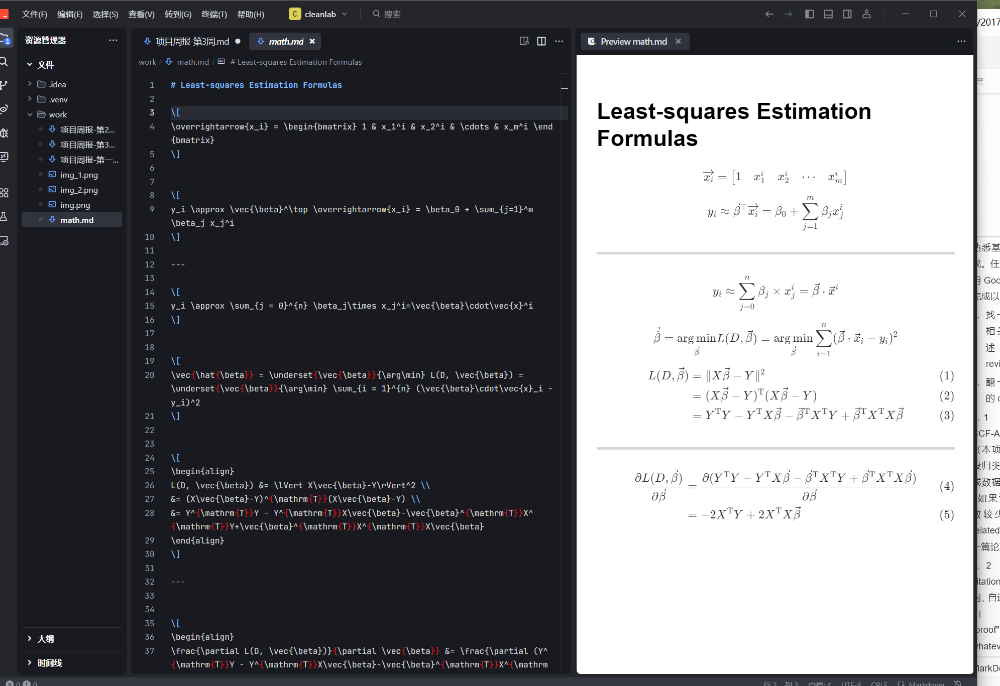

# 项目周报
日期：2025-4-19

项目实践题目：面向机器学习的数据清洗方法
### 实践内容
项目涉及到数据预处理和特征工程的学习，重点是如何清洗数据、探索数据集、识别数据中的问题，并使用相关工具来处理数据问题。
### 学习目标
- **学习Trae上使用Markdown Preview Enhanced插件进行md文件的预览**
- **学习基础的markdown的基础语法**
- **尝试使用Tex语法仿写数学公式**
- **对机器学习的基础知识进一步学习**
 
#### Markdown的基础语法总结
- 标题（Heading）
用于划分文档结构，共六级标题，通过 # 数量区分层级，至多为6级
- 加粗：    	** 文本 ** 或 _ _ 文本 _ _	
- 列表：     
        - 列表项1  
        - 列表项2  
        - 子列表项（缩进两个空格）  
        - 列表项3  
等等..........不做过多介绍

##### 通过对markdown语法的学习，我对markdown的基础语法有了初步了解。同时认为这种语法结构化清晰，适合文档编写，并且直观易读，无需多余代码
### 使用markdown Preview Enhanced插件与Tex语法进行数学公式的仿写，并进行预览

###### 成果如图——>

- 在进行markdown数学公式与Tex语法的接触学习前，一直不懂得如何将复杂的数学公式在电子设备中打出，通过学习收获了该项技能 

#### note1的读后收获
- 文章从监督学习的基本入手，清晰阐释了模型、数据、损失函数与优化目标之间的关系，让我认识到机器学习本质上是“通过数据寻找规律”的过程。机器学习的目标是通过数据构建模型，以预测或解释未知现象，主要分为监督学习（如回归、分类）和无监督学习（如聚类）。监督学习依赖带标签的数据，通过定义输入空间（特征）和输出空间（标签）建立映射关系，并利用损失函数衡量预测误差；无监督学习则从无标签数据中发现隐藏结构。模型性能通过训练误差（已知数据）和泛化误差（未知数据）评估，过拟合（模型过度适应训练噪声）是核心挑战，可通过正则化、模型选择及交叉验证缓解。指出机器学习需权衡模型复杂度与数据拟合程度

#### knn算法的学习收获
- 学习KNN算法与最近邻分类器让我深刻体会到其“基于实例学习”的核心思想。KNN无需显式训练，直接通过计算样本间距离（如欧氏距离）进行分类预测，其“懒惰学习”特性虽降低了模型复杂度，却面临计算效率瓶颈。核心参数K值需谨慎选择：过小易受噪声干扰导致过拟合，过大则可能模糊类别边界。该算法直观展现了“物以类聚”的朴素逻辑，但高维数据易受维度灾难影响，且对数据标准化敏感。kNN在中小规模分类任务中优势显著，但需权衡计算成本与模型精度的平衡，为理解更复杂算法奠定了基础。

### 本周学习收获
- **学会使用trae使用markdown编辑插件进行md语法编辑文档** 
- **对tex语法进行初步使用，了解了如何在文档中输出高级的数学表达式**
- **对机器学习的知识进一步学习** 
### 学习中的问题
- **没有较好的具体案例或者操作实例进行参考，对于知识还保留在理论了解不太懂得如何实践** 
