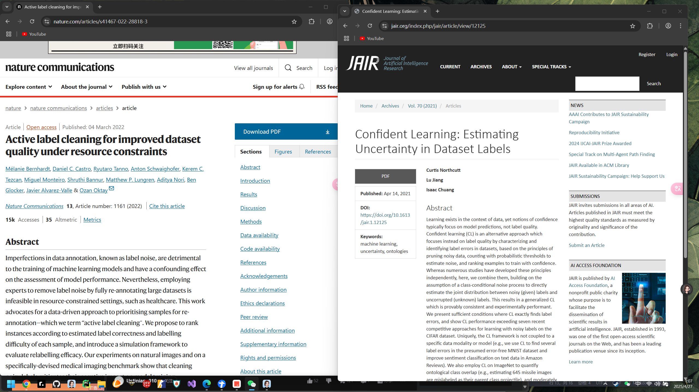
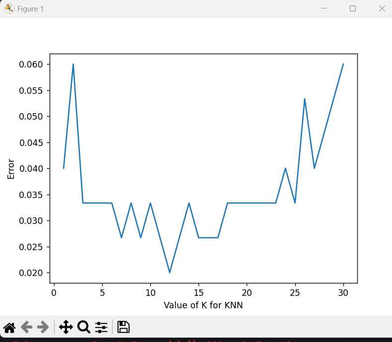
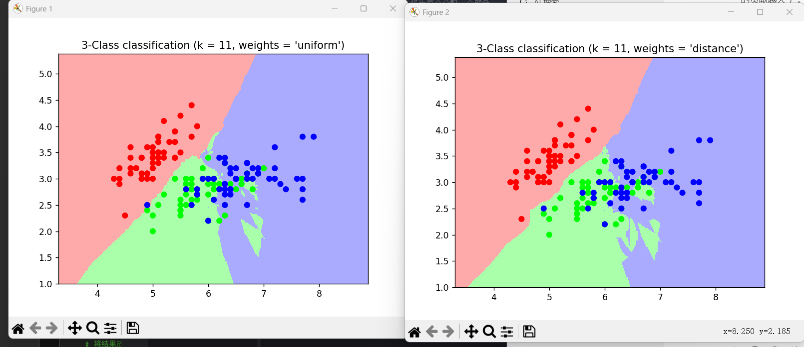

# 项目周报
日期：2025-4-26

项目实践题目：面向机器学习的数据清洗方法
### 实践内容
项目涉及到数据预处理和特征工程的学习，重点是如何清洗数据、探索数据集、识别数据中的问题，并使用相关工具来处理数据问题。
### 学习目标
- **学习使用Google Scholar来查找文献**
- **通过使用sklearn的官方数据集实现knn算法**
 
#### 使用Google Scholar来查找文献
- 对所给两篇论文的搜索结果：


- 使用Google Scholar进行文献搜索时，可以通过以下几种方式来查找文献：
  - 直接输入关键词：输入关键词后，Google Scholar会自动搜索与关键词相关的文献。
  - 高级搜索：Google Scholar提供了高级搜索功能，可以根据不同的搜索条件来查找文献。
  - 搜索结果过滤：Google Scholar提供了多种搜索结果过滤选项，可以根据不同的条件来过滤搜索结果。
  等等.......
###### 使用Google Scholar，体验颇为实用。它汇聚海量学术文献，搜索功能便捷，输入关键词就能获取诸多相关研究成果。查看引用文献功能方便梳理研究脉络，找综述或相关重要论文时很高效。对于学术探索来说，它是一个有价值的工具，能为研究提供丰富资料和思路。 
### 使用sklearn的官方数据集实现knn算法
#### sklearnknn算法中的一些参数介绍
- n_neighbors：k值，即选取最近的k个点
- weights：权重参数，默认是uniform，也可以选择distance，表示权重与距离成反比
- algorithm：搜索算法，默认是auto，可以选择ball_tree、kd_tree、brute
- leaf_size：如果是选择ball_tree或者kd_tree，可以设置叶子节点数量   
- metric：距离度量，默认是minkowski，可以选择其他距离度量方式，如欧氏距离、曼哈顿距离等
- p：距离度量公式的幂参数，当p=1时，为曼哈顿距离，p=2时，为欧氏距离
- metric_params：距离度量公式的其他关键参数
- n_jobs：并行任务数量
#### 通过sklearn中提供的交叉验证的方式来确定k的取值
- 相关代码如下
```python
import sklearn
from sklearn.datasets import load_iris
from sklearn.model_selection  import cross_val_score
import matplotlib.pyplot as plt
from sklearn.neighbors import KNeighborsClassifier

#读取鸢尾花数据集
iris = load_iris()
x = iris.data
y = iris.target
k_range = range(1, 31)
k_error = []
#循环，取k=1到k=31，查看误差效果
for k in k_range:
    knn = KNeighborsClassifier(n_neighbors=k)
    #cv参数决定数据集划分比例，这里是按照5:1划分训练集和测试集
    scores = cross_val_score(knn, x, y, cv=6, scoring='accuracy')
    k_error.append(1 - scores.mean())

#画图，x轴为k值，y值为误差值
plt.plot(k_range, k_error)
plt.xlabel('Value of K for KNN')
plt.ylabel('Error')
plt.show()
```
- 在运行程序后可以获得如下图所示k不同取值时的方差


- 可以看出当k=11时，方差最小，所以k取11时效果最好
有了K值就能运行KNN算法了，具体代码如下：
```python
import matplotlib.pyplot as plt
from numpy import *
from matplotlib.colors import ListedColormap
from sklearn import neighbors, datasets
import numpy as np
n_neighbors = 11

# 导入一些的数据
iris = datasets.load_iris()
x = iris.data[:, :2]  # 采用前两个feature,方便画图在二维平面显示
y = iris.target


h = .02  # 网格中的步长

# 创建彩色的图
cmap_light = ListedColormap(['#FFAAAA', '#AAFFAA', '#AAAAFF'])
cmap_bold = ListedColormap(['#FF0000', '#00FF00', '#0000FF'])


#weights是KNN模型中的一个参数，上述参数介绍中有介绍，这里绘制两种权重参数下KNN的效果图
for weights in ['uniform', 'distance']:
    # 创建了一个knn分类器的实例，并拟合数据。
    clf = neighbors.KNeighborsClassifier(n_neighbors, weights=weights)
    clf.fit(x, y)

    # 绘制决策边界。为此，将为每个分配一个颜色
    # 来绘制网格中的点 [x_min, x_max]x[y_min, y_max].
    x_min, x_max = x[:, 0].min() - 1, x[:, 0].max() + 1
    y_min, y_max = x[:, 1].min() - 1, x[:, 1].max() + 1
    xx, yy = np.meshgrid(np.arange(x_min, x_max, h),
                         np.arange(y_min, y_max, h))
    Z = clf.predict(np.c_[xx.ravel(), yy.ravel()])

    # 将结果放入一个彩色图中
    Z = Z.reshape(xx.shape)
    plt.figure()
    plt.pcolormesh(xx, yy, Z, cmap=cmap_light)

    # 绘制训练点
    plt.scatter(x[:, 0], x[:, 1], c=y, cmap=cmap_bold)
    plt.xlim(xx.min(), xx.max())
    plt.ylim(yy.min(), yy.max())
    plt.title("3-Class classification (k = %i, weights = '%s')"
              % (n_neighbors, weights))

plt.show()
```
- 运行后可以得到两种不同权重参数下的KNN算法的效果图

 
- 两者差异
决策边界：
左图（weights = 'uniform'）：由于每个邻居点权重相同，决策边界相对较为平滑和规则，不同类别区域的划分相对比较 “硬” ，边界受每个邻居点的平均影响。
右图（weights = 'distance'）：因为距离近的邻居点权重更大，决策边界会更倾向于靠近样本点密集的区域，边界形状可能会更曲折，更能适应样本分布的局部特征 

### 本周学习收获
- 通过使用Google Scholar来查找文献，学习了如何使用Google Scholar进行文献搜索，以及如何利用搜索结果来查找相关研究成果。
- 通过使用sklearn的官方数据集实现knn算法，学习了如何使用sklearn中的交叉验证的方式来确定k的取值，以及如何使用KNN算法来进行分类任务。
- 学习了KNN算法的一些参数，以及如何使用KNN算法来进行分类任务。

#### 补充对论文 Active label cleaning for improved dataset quality under resource constraints的读后体会总结
- 论文主要介绍了一种用于改进数据集质量的方法，该方法基于主动学习的思想，通过对未标记数据的主动查询和学习来提高数据集的质量。
- 方法：
*主动标签清洗：
提出一种顺序标签清洗过程，在资源预算B下，最大化正确标注样本数量。通过训练分类模型的预测后验确定重新标注优先级，每次迭代按标签正确性和模糊度对样本排序，由不同标注者依次审核，直至形成多数标签。*
*实验数据集：
CIFAR10H：包含 CIFAR10 测试集的 10,000 张自然图像，每个图像平均有 51 个标注，用于研究不同噪声率、模型和主动重新标注场景。
NoisyCXR：包含 26,684 张胸部 X 光片，基于 NIH 数据集构建，用于医学图像标签清洗的挑战性基准测试。*
- 实验结果：
标签噪声的影响：在 CIFAR10H 数据集上，有 30% 标签噪声时，普通 CNN 分类器准确率从 73.6% 降至 64.1%；验证标签噪声会低估模型性能，影响模型选择。
标签清洗效果：所有训练方法在标签清洗后都有收益，如在 CIFAR10H 数据集上，SSL - Linear 方法比随机选择在达到 90% 正确标签时少 2.5 倍重新标注次数。
评分函数影响：包含熵项的评分函数能更好地优先处理清晰的标签噪声案例，提高标签清洗效果；与 BALD 方法相比，本文评分函数在提高数据集标签质量上更具优势。
评估标签清洗：在 CIFAR10H 数据集上实验，对噪声验证集进行主动重新标注（如 SSL - Linear 方法重新标注 10% 数据），可减轻模型选择偏差，将噪声率分别降至 31.32%（IDN）和 30.25%（SYM）


#### 阅读论文后的几个主要问题思考
- 主动标签清洗与传统主动学习的区别是什么？
传统主动学习目标是选择对训练最有益的未标注样本以提高模型性能；而主动标签清洗不仅要提高模型性能，还旨在有限资源下最大化标签质量，且允许对已标注实例进行重新标注，用于模型训练和基准测试。
- 实验中使用的两个数据集有什么特点？
CIFAR10H 包含 CIFAR10 测试集的 10,000 张自然图像，每个图像平均有 51 个标注，用于研究不同噪声相关场景。NoisyCXR 包含 26,684 张胸部 X 光片，是基于 NIH 数据集构建的有噪声版本，用于医学图像标签清洗基准测试，其样本分为 “肺炎样肺不透明度” 和 “无肺炎样肺不透明度” 两类，噪声率为 12.6%。


### 遇到的困难
在论文中官方给出了相关的标签清洗的开源代码库，在对论文理论基础进行学习后，目前在论文方法的复现上云里雾里，开源的代码库里的代码资源不能较好的看懂与使用