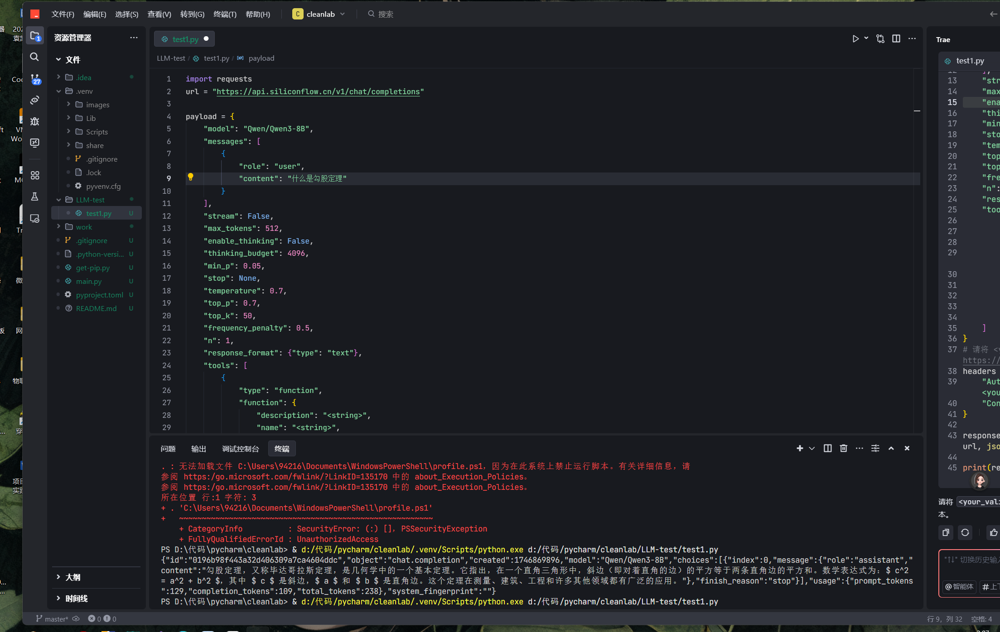

# 项目周报
日期：2025-5-10

项目实践题目：面向机器学习的数据清洗方法
### 实践内容
项目涉及到数据预处理和特征工程的学习，重点是如何清洗数据、探索数据集、识别数据中的问题，并使用相关工具来处理数据问题。
### 学习目标
- **学会使用LLM通用API（用编程的方式使用LLM）**
- **对论文中所给的代码库进行理解**

###### 如图所示，通过API key，使用编程的方式调用了通义千问大模型，实现了基础的文本对话解答功能，在使用过程中，对各种参数也进行了了解，在调用时，需要对参数进行设置，以实现不同的功能。

### 论文中所给的代码库进行理解
- 第一个主函数代码 “main_simulation.py"通过主动学习模拟，选择最优的数据筛选策略修正标注噪声。
输出生成清洗后的数据集（保存至 MAIN_SIMULATION_DIR 目录下的 .hdf 文件）,属于是数据质量优化的功能
- 第二个代码”model_selection_benchmark.py“目标是加载清洗后的数据对比不同模型在 原始噪声数据 和 清洗后数据 上的性能差异。
### 遇到的困难
- 在代码的阅读中难以与论文中提到的数据清洗方式的方法与代码逻辑对应，大部分还是通过ai或者其他途径来了解代码每一段作用。